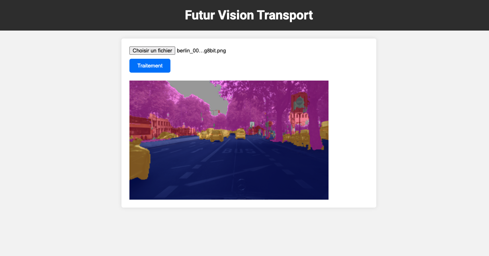

# APP Computer Vision

[](LICENSE)

Here is my computer vision application using FastAPI which provides a simple and powerful interface for integrating image processing functionalities.   

## Description  

With image classification, pattern detection and semantic segmentation functionalities, my API provides the possibility of being integrated into decision-making tools, opening the way to an infinite range of applications, from intelligent surveillance to augmented reality.  



## Table of Contents

- [Getting Started](#Getting-Started)
- [Launch Application](#Launch-Application)
- [Contributing](#Contributing)
- [License](#License)  

## Getting Started  

You can't use my training model because of Github storage. But if you train your own model you can install and use my repository like this.  

```bash
git clone https://github.com/HaDock404/app-vision-futur_transport.git
cd app-vision-futur_transport
pip install -r ./packages/requirements.txt
```  

## Launch Application  

You can't use my training model because of Github storage. But if you train your own model you can install and use my repository like this.  

```bash
uvicorn main:app --reload
```  

## Contributing

Pull requests are welcome. For major changes, please open an issue first
to discuss what you would like to change.

Please make sure to update tests as appropriate.

## License  

This project is licensed under the MIT License - see the [LICENSE](./LICENSE) file for details.